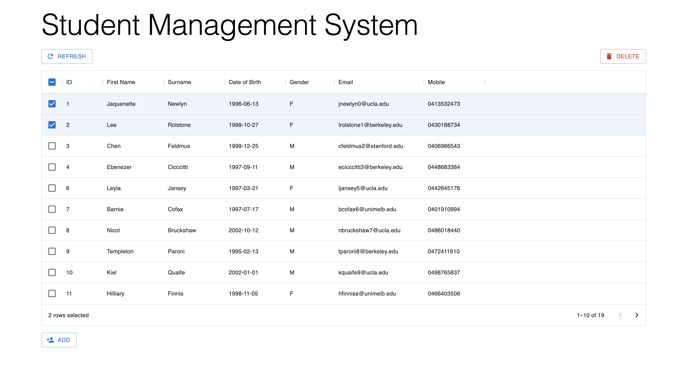
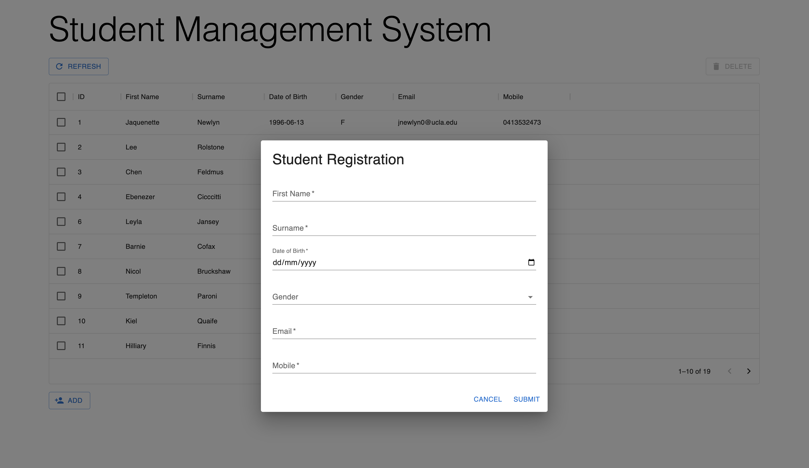

# Student Management System

The goal of this project is to gain experience with a full stack project, including a `frontend`, a `backend`, and a `database`.

## Tech Stack

- `React TypeScript` frontend with `MUI` and `Formik`
- `Java Spring Boot` backend
- `PostgreSQL` database

The project is about a student management system to store basic information about students. I built the frontend with React which mainly includes a table to display the student data and some forms and buttons for user input. I created a RESTful API backend using Spring Web to support GET, POST, PUT, and DELETE requests for the client to interact with the students' data on the server. The Spring application interacts with the PostgreSQL database on requests so data is stored persistently.

## Desktop Preview

 

_Note: The data used is purely fictitious for the purposes of the demonstration_
